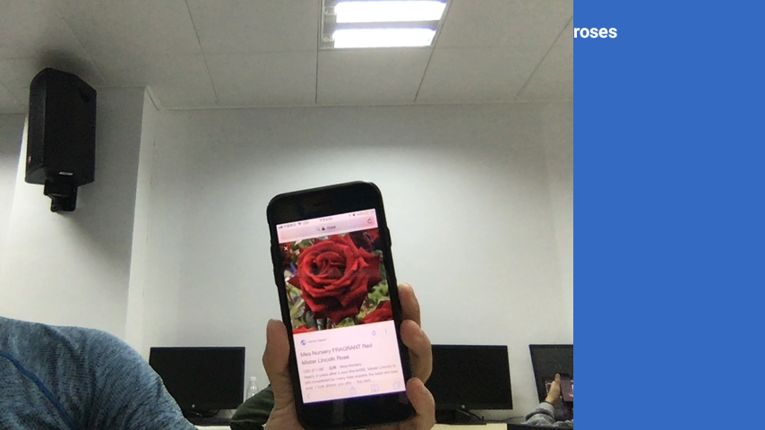
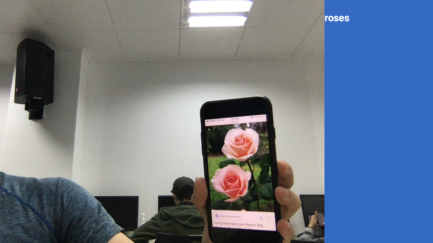
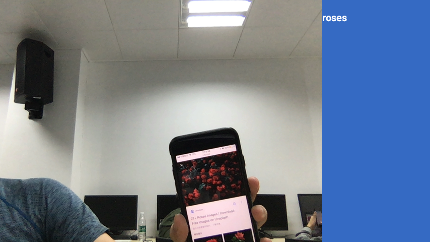
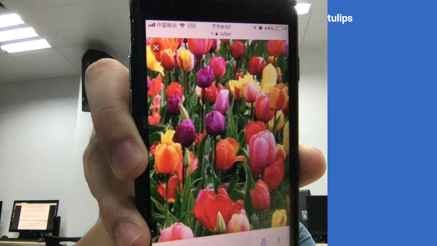
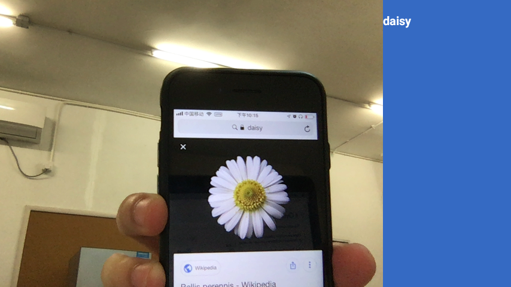
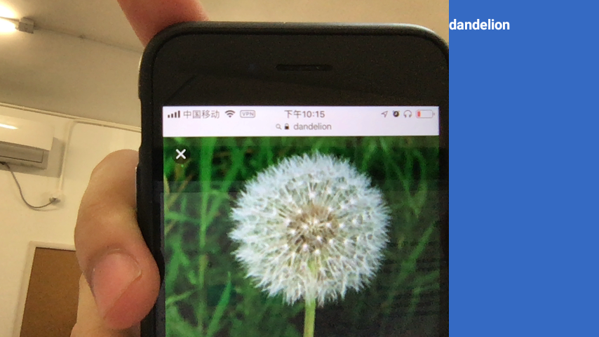
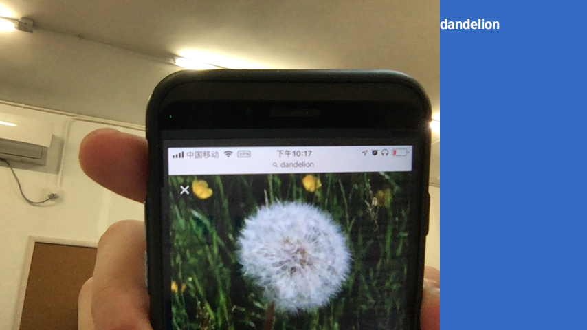
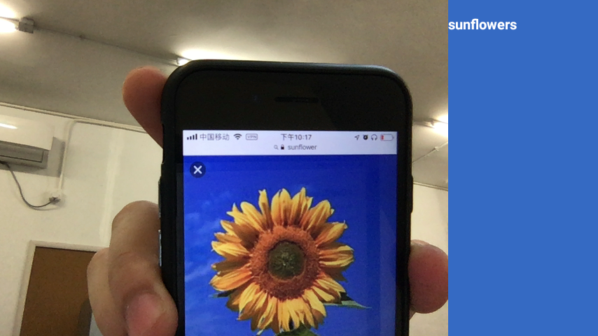

# tensorflow-lab-chenminken

# Overview

This repo contains code for the "TensorFlow for poets 2" series of codelabs.

There are multiple versions of this codelab depending on which version 
of the tensorflow libraries you plan on using:

* For [TensorFlow Lite](https://www.tensorflow.org/mobile/tflite/) the new, ground up rewrite targeted at mobile devices
  use [this version of the codelab](https://codelabs.developers.google.com/codelabs/tensorflow-for-poets-2-tflite) 
* For the more mature [TensorFlow Mobile](https://www.tensorflow.org/mobile/mobile_intro) use 
  [this version of the codealab](https://codelabs.developers.google.com/codelabs/tensorflow-for-poets-2).

This repo contains simplified and trimmed down version of tensorflow's example image classification apps.

* The TensorFlow Lite version, in `android/tflite`, comes from [tensorflow/contrib/lite/](https://github.com/tensorflow/tensorflow/tree/master/tensorflow/contrib/lite).
* The Tensorflow Mobile version, in `android/tfmobile`, comes from [tensorflow/examples/android/](https://github.com/tensorflow/tensorflow/tree/master/tensorflow/examples/android).

The `scripts` directory contains helpers for the codelab. Some of these come from the main TensorFlow repository, and are included here so you can use them without also downloading the main TensorFlow repo (they are not part of the TensorFlow `pip` installation).

